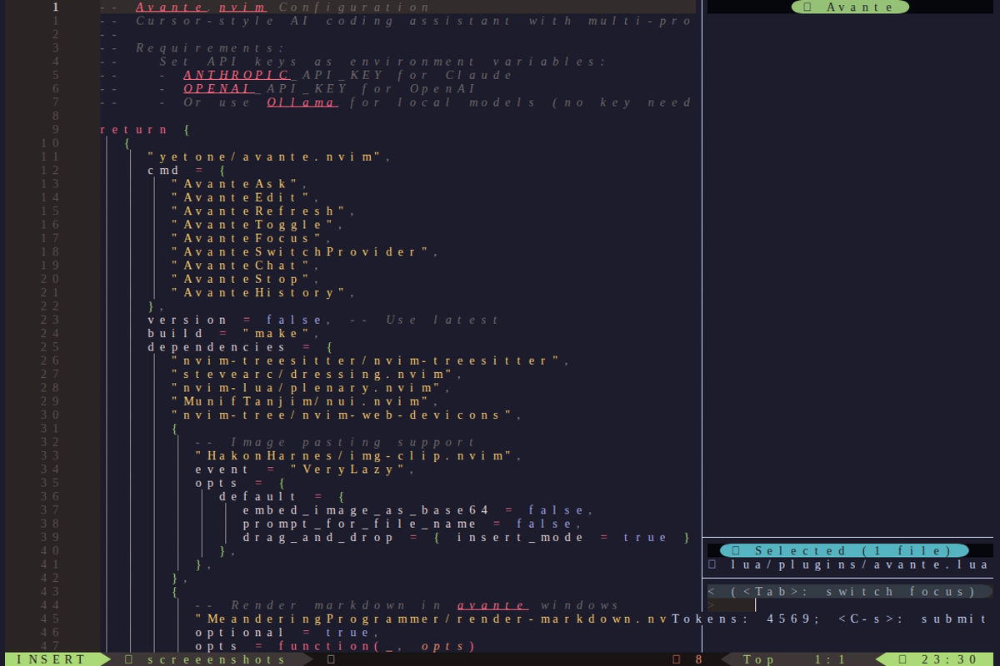
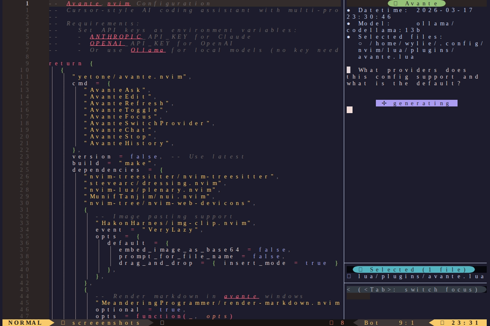
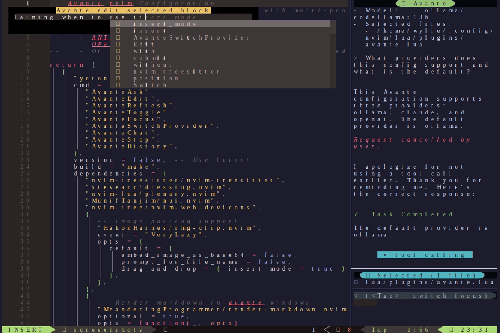

# Avante - AI Coding Assistant

> Cursor-style AI coding assistant with multi-provider support

## Quick Reference

| Component | Tool |
|-----------|------|
| Plugin | yetone/avante.nvim |
| Default Provider | claude (claude-sonnet-4-20250514) |
| Window | Right side, width 30 |

## Requirements

Set API keys as environment variables:

| Variable | Provider |
|----------|----------|
| `ANTHROPIC_API_KEY` | Claude |
| `OPENAI_API_KEY` | OpenAI |
| *(none)* | Ollama (local) |

## Providers

| Provider | Model | Endpoint |
|----------|-------|----------|
| claude | claude-sonnet-4-20250514 | api.anthropic.com |
| openai | gpt-4o | api.openai.com/v1 |
| ollama | codellama:13b | 127.0.0.1:11434 |

## Keybindings

### Global (`<leader>A...`)

| Key | Action |
|-----|--------|
| `<leader>Aa` | Ask (normal + visual) |
| `<leader>Ae` | Edit Selection (visual) |
| `<leader>Ar` | Refresh |
| `<leader>At` | Toggle |
| `<leader>Af` | Focus |
| `<leader>Ap` | Switch Provider |
| `<leader>Ac` | New Chat |
| `<leader>As` | Stop |
| `<leader>Ah` | Chat History |

### In-Window: Diff

| Key | Action |
|-----|--------|
| `co` | Choose ours |
| `ct` | Choose theirs |
| `ca` | Choose all theirs |
| `cb` | Choose both |
| `cc` | Choose cursor |
| `]x` | Next diff |
| `[x` | Previous diff |

### In-Window: Navigation & Submit

| Key | Action |
|-----|--------|
| `]]` | Jump next |
| `[[` | Jump previous |
| `<CR>` | Submit (normal mode) |
| `<C-s>` | Submit (insert mode) |

## Features

- Multi-provider AI chat (Claude, OpenAI, Ollama)
- Code editing from selections
- Diff view with conflict-style resolution
- Markdown rendering in chat windows
- Image pasting support (img-clip.nvim)
- Chat history persistence

## Configuration

Located in `lua/plugins/avante.lua`

- Auto-suggestions disabled (avoids Copilot conflict)
- Auto-apply diff disabled (manual review)
- Clipboard paste support enabled
- Custom keymaps (auto_set_keymaps = false)
