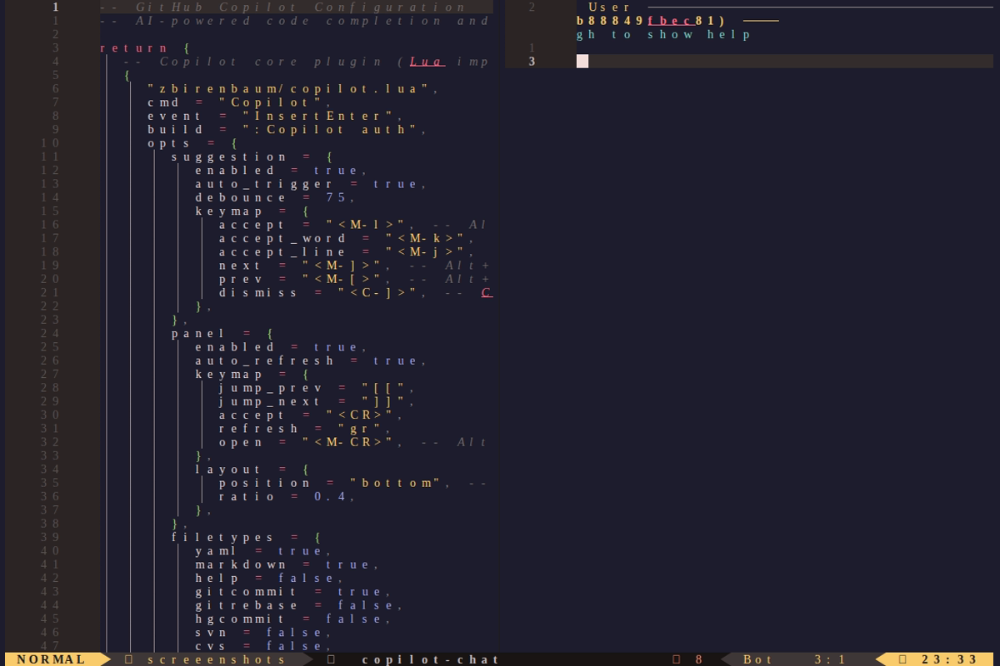
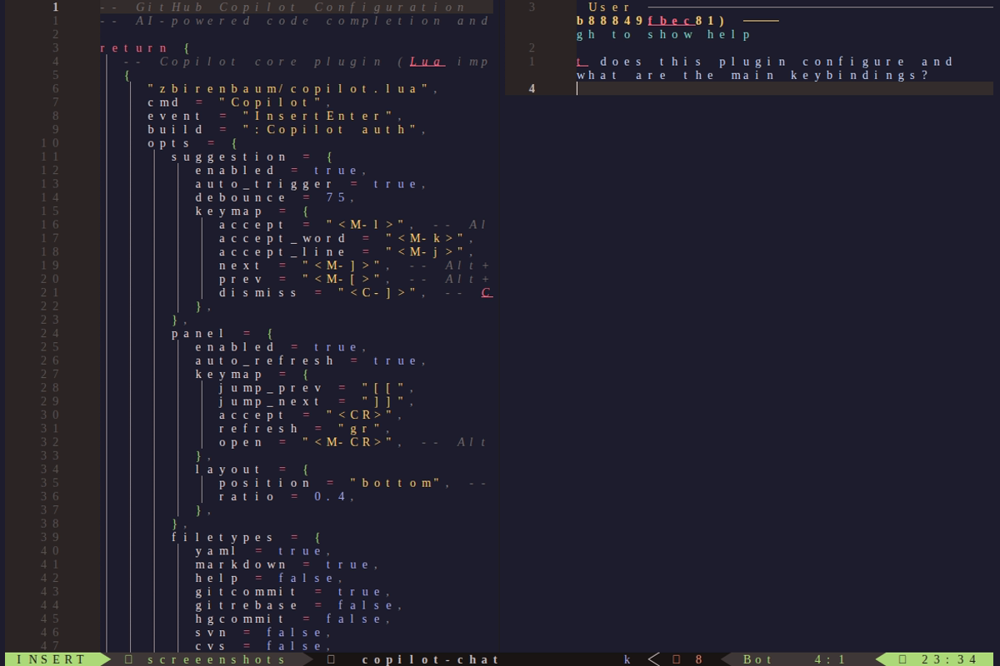

# GitHub Copilot

> AI-powered code completion and chat assistant




## Quick Reference

| Component | Tool |
|-----------|------|
| Core | copilot.lua |
| Completion | copilot-cmp |
| Chat | CopilotChat.nvim |

## Features

- Inline code suggestions
- Auto-trigger completions
- Multi-line suggestions
- Copilot Chat integration
- Code explanation and review
- Test generation
- Documentation generation
- Commit message generation

## Keybindings

### Inline Suggestions (Insert Mode)

| Key | Action |
|-----|--------|
| `<M-l>` | Accept suggestion |
| `<M-k>` | Accept word |
| `<M-j>` | Accept line |
| `<M-]>` | Next suggestion |
| `<M-[>` | Previous suggestion |
| `<C-]>` | Dismiss suggestion |
| `<M-CR>` | Open panel |

### Copilot Management (`<leader>cp...`)

| Key | Action |
|-----|--------|
| `<leader>cpe` | Enable Copilot |
| `<leader>cpd` | Disable Copilot |
| `<leader>cps` | Copilot Status |
| `<leader>cpp` | Copilot Panel |
| `<leader>cpt` | Toggle Suggestions |

### Copilot Chat (`<leader>a...`)

| Key | Action |
|-----|--------|
| `<leader>aa` | Toggle Chat |
| `<leader>ax` | Reset Chat |
| `<leader>as` | Stop Output |
| `<leader>aq` | Quick Chat |
| `<leader>ap` | Prompt Actions |
| `<leader>ah` | Select Model |

### Code Actions (Normal & Visual)

| Key | Action |
|-----|--------|
| `<leader>ae` | Explain Code |
| `<leader>ar` | Review Code |
| `<leader>af` | Fix Code |
| `<leader>ao` | Optimize Code |
| `<leader>ad` | Generate Docs |
| `<leader>at` | Generate Tests |
| `<leader>aD` | Fix Diagnostic |

### Git Integration

| Key | Action |
|-----|--------|
| `<leader>ac` | Generate Commit Message |
| `<leader>aC` | Commit Staged Changes |

### Chat Window

| Key | Action |
|-----|--------|
| `q` | Close chat |
| `<C-c>` | Close (insert) |
| `<CR>` | Submit prompt |
| `<C-s>` | Submit (insert) |
| `<C-r>` | Reset chat |
| `<C-y>` | Accept diff |
| `gy` | Yank diff |
| `gd` | Show diff |
| `gp` | Show system prompt |
| `gs` | Show user selection |
| `[[` / `]]` | Navigate suggestions |

## Installation

### Prerequisites

```bash
# Node.js 18+ required
node --version  # Should be >= 18.x

# Install Node if needed (Arch)
sudo pacman -S nodejs npm
```

### First-Time Setup

1. Open Neovim
2. Run `:Copilot auth`
3. Follow the GitHub authentication flow
4. Verify with `:Copilot status`

## Configuration

### Filetypes

Enable/disable Copilot for specific filetypes:
```lua
filetypes = {
  yaml = true,
  markdown = true,
  help = false,
  gitcommit = true,
  -- Disable for specific files
  [".env"] = false,
}
```

### Chat Models

Available models:
- `gpt-4o` (default)
- `gpt-4`
- `gpt-3.5-turbo`

Change model: `<leader>ah` or `:CopilotChatModels`

## Usage Examples

### Code Completion
1. Start typing code
2. Wait for ghost text suggestion
3. `<M-l>` to accept full suggestion
4. Or `<M-k>` to accept word-by-word

### Code Review
1. Select code in visual mode
2. `<leader>ar` to review
3. Read suggestions in chat window

### Generate Tests
1. Select function/code block
2. `<leader>at` to generate tests
3. `<C-y>` to accept suggested code

### Quick Questions
1. `<leader>aq`
2. Type your question
3. Get AI response in chat window

### Fix Errors
1. Position cursor on diagnostic
2. `<leader>aD` to fix
3. Review and accept changes

## Troubleshooting

### Check Status
```vim
:Copilot status
```

### Re-authenticate
```vim
:Copilot auth
```

### Debug Mode
```vim
:CopilotChat debug
```

### Common Issues

**Suggestions not appearing:**
- Check `:Copilot status`
- Verify Node.js version >= 18
- Check if filetype is enabled

**Slow suggestions:**
- Adjust `debounce` value in config
- Check network connectivity

**Chat not responding:**
- Run `:CopilotChatReset`
- Check model availability
