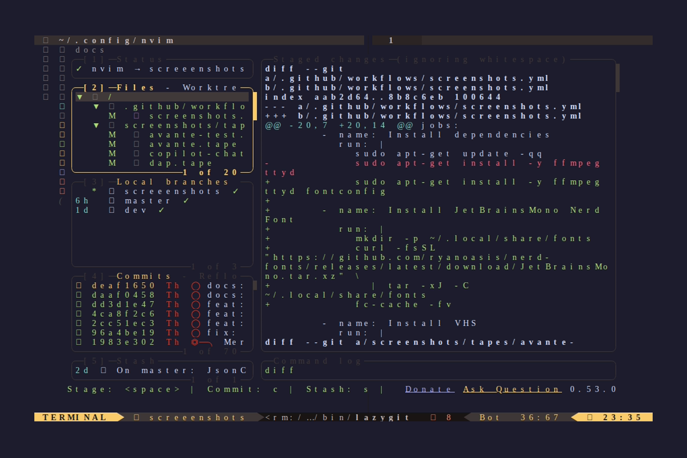
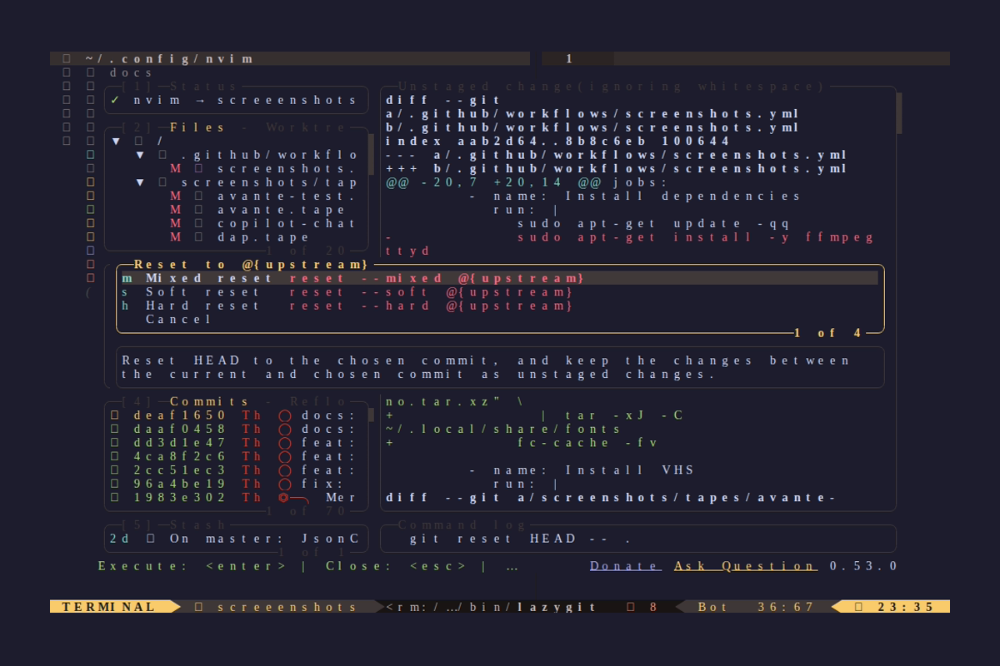

# Diffview - Git Diff Viewer

> Tabpage-based interface for viewing git diffs and file history




## Quick Reference

| Component | Tool |
|-----------|------|
| Plugin | sindrets/diffview.nvim |
| Features | Diff view, file history, merge tool |

## Features

- Side-by-side diff view
- File history browser
- Merge conflict resolution
- Staging/unstaging from diff
- Branch comparison
- Commit history navigation

## Keybindings

### Open/Close (`<leader>g...`)

| Key | Action |
|-----|--------|
| `<leader>gd` | Open Diffview (working changes) |
| `<leader>gD` | Open Diffview (last commit) |
| `<leader>gc` | Close Diffview |
| `<leader>gf` | Toggle file panel |
| `<leader>gR` | Refresh |

### File History

| Key | Action |
|-----|--------|
| `<leader>gh` | Current file history |
| `<leader>gH` | Branch history |
| `<leader>gh` (visual) | Selection history |

### Compare

| Key | Action |
|-----|--------|
| `<leader>gB` | Compare with branch |
| `<leader>gC` | Compare with commit |

## Diff View Keymaps

### Navigation

| Key | Action |
|-----|--------|
| `<Tab>` | Next file |
| `<S-Tab>` | Previous file |
| `gf` | Open file |
| `<C-w><C-f>` | Open file (split) |
| `<C-w>gf` | Open file (tab) |
| `<leader>e` | Focus file panel |
| `<leader>b` | Toggle file panel |
| `g<C-x>` | Cycle layout |

### Conflict Resolution

| Key | Action |
|-----|--------|
| `]x` | Next conflict |
| `[x` | Previous conflict |
| `<leader>co` | Choose OURS |
| `<leader>ct` | Choose THEIRS |
| `<leader>cb` | Choose BASE |
| `<leader>ca` | Choose ALL |
| `dx` | Delete conflict region |
| `<leader>cO` | Choose OURS (all conflicts) |
| `<leader>cT` | Choose THEIRS (all conflicts) |
| `<leader>cB` | Choose BASE (all conflicts) |

### 3-Way Diff (Merge)

| Key | Action |
|-----|--------|
| `2do` | Get from OURS (left) |
| `3do` | Get from THEIRS (right) |

## File Panel Keymaps

### Navigation

| Key | Action |
|-----|--------|
| `j` / `k` | Next/previous entry |
| `<CR>` / `o` / `l` | Open diff |
| `h` | Close fold |
| `zo` | Open fold |
| `za` | Toggle fold |
| `zR` | Open all folds |
| `zM` | Close all folds |

### Staging

| Key | Action |
|-----|--------|
| `-` / `s` | Stage/unstage file |
| `S` | Stage all |
| `U` | Unstage all |
| `X` | Restore file (discard changes) |

### Other

| Key | Action |
|-----|--------|
| `L` | Open commit log |
| `i` | Toggle listing style |
| `f` | Toggle flatten dirs |
| `R` | Refresh files |
| `g?` | Show help |

## File History Panel Keymaps

| Key | Action |
|-----|--------|
| `j` / `k` | Next/previous entry |
| `<CR>` / `o` | Open diff |
| `y` | Copy commit hash |
| `L` | Open commit log |
| `g!` | Options |
| `<C-A-d>` | Open in diffview |
| `g?` | Show help |

## Usage Examples

### Review Working Changes

```vim
<leader>gd          " Open diffview
                    " See all changed files on left
                    " Side-by-side diff on right
j/k                 " Navigate files
<CR>                " Open diff for file
-                   " Stage/unstage file
<leader>gc          " Close when done
```

### Review Last Commit

```vim
<leader>gD          " Open diff of HEAD~1
                    " See what changed in last commit
```

### Compare with Branch

```vim
<leader>gB          " Prompted for branch name
main                " Enter branch name
                    " See all differences from main
```

### File History

```vim
<leader>gh          " Open history for current file
                    " See all commits that touched this file
j/k                 " Navigate commits
<CR>                " See diff for that commit
y                   " Copy commit hash
```

### Resolve Merge Conflicts

```vim
" During a merge conflict:
<leader>gd          " Open diffview
                    " 3-way diff: OURS | BASE | THEIRS
]x                  " Jump to next conflict
<leader>co          " Choose our version
" OR
<leader>ct          " Choose their version
" OR
<leader>ca          " Keep both
:w                  " Save
<leader>gc          " Close
```

### Stage Individual Hunks

```vim
<leader>gd          " Open diffview
                    " Navigate to file
                    " In diff view, use visual mode
                    " to select specific lines
-                   " Stage selection
```

## Command Reference

```vim
:DiffviewOpen                    " Working directory changes
:DiffviewOpen HEAD~1             " Last commit
:DiffviewOpen HEAD~3             " Last 3 commits
:DiffviewOpen main               " Compare with main
:DiffviewOpen main..feature      " Compare branches
:DiffviewOpen origin/main...HEAD " Compare with remote
:DiffviewOpen --staged           " Only staged changes

:DiffviewFileHistory             " Current branch history
:DiffviewFileHistory %           " Current file history
:DiffviewFileHistory path/to/file
:DiffviewFileHistory --range=origin..HEAD

:DiffviewClose                   " Close diffview
:DiffviewToggleFiles             " Toggle file panel
:DiffviewRefresh                 " Refresh
```

## Layouts

Cycle layouts with `g<C-x>`:

- `diff2_horizontal` - Side by side (default)
- `diff2_vertical` - Top/bottom
- `diff3_horizontal` - 3-way merge horizontal
- `diff3_vertical` - 3-way merge vertical
- `diff4_mixed` - 4-way merge

## Tips

### Quick Review Workflow

1. `<leader>gd` - Open diffview
2. `S` - Stage all (if everything looks good)
3. `<leader>gc` - Close
4. Commit with your preferred method

### Selective Staging

1. `<leader>gd` - Open diffview
2. Navigate to files
3. `-` to stage/unstage individual files
4. Use `X` to discard unwanted changes

### Comparing Specific Commits

```vim
:DiffviewOpen abc123^!           " Single commit
:DiffviewOpen abc123..def456     " Range of commits
```

### Integration with Fugitive

Diffview works alongside vim-fugitive. Use whichever is more convenient for the task.

## See Also

- [Diffview GitHub](https://github.com/sindrets/diffview.nvim)
- [gitsigns.nvim](https://github.com/lewis6991/gitsigns.nvim) - Inline git signs
- [neogit](https://github.com/NeogitOrg/neogit) - Magit-style interface
