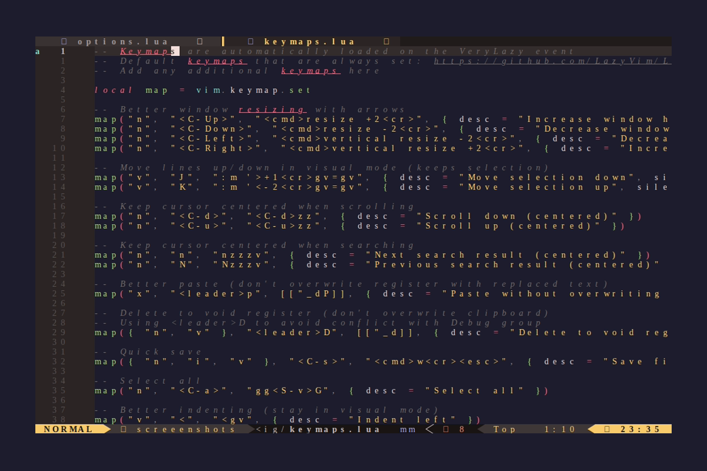

# Harpoon - Quick File Navigation

> Mark files and instantly jump between them

## Quick Reference

| Component | Tool |
|-----------|------|
| Plugin | ThePrimeagen/harpoon (v2) |
| Storage | Per-project file lists |
| Integration | Telescope picker |




## Concept

Harpoon lets you "mark" files you're actively working on and jump to them instantly with a single keystroke. Instead of fuzzy-finding or navigating the file tree, you press `<leader>1` to go to your first marked file, `<leader>2` for the second, etc.

**Typical workflow:**
1. Mark 3-5 files you're working on
2. Jump between them with `<leader>1-5`
3. When done, clear and mark new files

## Keybindings

### Managing Files (`<leader>h...`)

| Key | Action |
|-----|--------|
| `<leader>ha` | Add current file to list |
| `<leader>hr` | Remove current file from list |
| `<leader>hh` | Toggle Harpoon menu |
| `<leader>hf` | Open in Telescope |
| `<leader>hc` | Clear all marks |

### Quick Navigation

| Key | Action |
|-----|--------|
| `<leader>1` | Jump to file 1 |
| `<leader>2` | Jump to file 2 |
| `<leader>3` | Jump to file 3 |
| `<leader>4` | Jump to file 4 |
| `<leader>5` | Jump to file 5 |

### Sequential Navigation

| Key | Action |
|-----|--------|
| `<leader>hn` | Next file in list |
| `<leader>hp` | Previous file in list |
| `]h` | Next file in list |
| `[h` | Previous file in list |

### Replace at Position

| Key | Action |
|-----|--------|
| `<leader>h1` | Replace slot 1 with current file |
| `<leader>h2` | Replace slot 2 with current file |
| `<leader>h3` | Replace slot 3 with current file |
| `<leader>h4` | Replace slot 4 with current file |
| `<leader>h5` | Replace slot 5 with current file |

## Harpoon Menu

Press `<leader>hh` to open the menu:

```
┌─────────────────────────────────┐
│ Harpoon                         │
├─────────────────────────────────┤
│ 1. src/components/Button.tsx    │
│ 2. src/hooks/useAuth.ts         │
│ 3. src/api/client.ts            │
│ 4. tests/auth.test.ts           │
└─────────────────────────────────┘
```

### Menu Controls

| Key | Action |
|-----|--------|
| `j/k` | Navigate up/down |
| `<CR>` | Open file |
| `dd` | Remove file |
| `p` | Paste (reorder) |
| `q` / `<Esc>` | Close menu |

You can edit the menu like a buffer - delete lines to remove files, reorder by moving lines.

## Usage Examples

### Basic Workflow

```
1. Open important file
2. <leader>ha          -- Add to harpoon
3. Open another file
4. <leader>ha          -- Add to harpoon
5. <leader>1           -- Jump back to first file
6. <leader>2           -- Jump to second file
```

### Working on a Feature

```
# Mark your working files
<leader>ha  on src/feature.ts
<leader>ha  on src/feature.test.ts
<leader>ha  on src/types.ts

# Now quickly jump between them
<leader>1   -- feature.ts
<leader>2   -- feature.test.ts
<leader>3   -- types.ts

# When done, clear for next feature
<leader>hc
```

### Replacing a Slot

If slot 1 has the wrong file:

```
# Open the correct file
# Then replace slot 1
<leader>h1
```

### Using Telescope

```
<leader>hf   -- Opens Telescope with harpooned files
             -- Fuzzy search through your marks
```

## Project-Specific Lists

Harpoon automatically maintains separate lists per project:
- Uses git root as project identifier
- Falls back to current working directory
- Lists persist between sessions

## Tips

### Keep It Small
- 3-5 files is ideal
- More than 5 defeats the purpose (use Telescope instead)

### Consistent Ordering
- Put main file at 1
- Put test file at 2
- Put types/interfaces at 3

### Use Replace, Not Remove+Add
- `<leader>h1` is faster than `<leader>hr` then navigating

### Quick Add from Telescope
- Find file with Telescope
- Immediately `<leader>ha` to harpoon it

## Configuration

### Custom Keybindings

To use different keys, modify `lua/plugins/harpoon.lua`:

```lua
-- Example: Use F1-F5 instead
map("n", "<F1>", function() harpoon:list():select(1) end)
map("n", "<F2>", function() harpoon:list():select(2) end)
-- etc.
```

### Disable Telescope Integration

Remove the `toggle_telescope` function and `<leader>hf` mapping if not using Telescope.

## See Also

- [Harpoon GitHub](https://github.com/ThePrimeagen/harpoon/tree/harpoon2)
- [ThePrimeagen's Harpoon Video](https://www.youtube.com/watch?v=Qnos8aApa9g)
