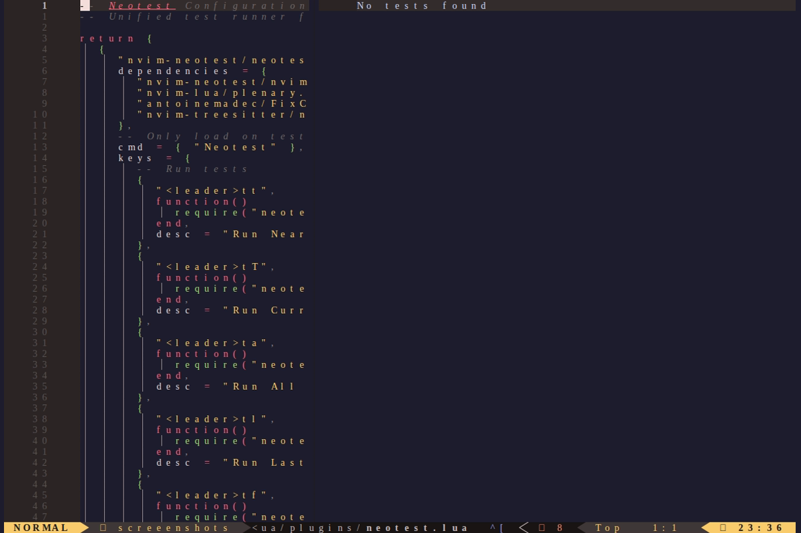

# Neotest - Test Runner

> Unified test framework for Neovim with adapters for multiple languages




## Quick Reference

| Component | Tool |
|-----------|------|
| Core | nvim-neotest/neotest |
| UI | Summary panel, output panel, virtual text |
| Debug | DAP integration |

## Supported Languages

| Language | Adapter | Test Framework |
|----------|---------|----------------|
| Python | neotest-python | pytest, unittest |
| Go | neotest-go | go test |
| Rust | neotest-rust | cargo test |
| JavaScript/TypeScript | neotest-vitest | Vitest |
| JavaScript/TypeScript | neotest-jest | Jest |
| Elixir | neotest-elixir | ExUnit |
| Haskell | neotest-haskell | hspec, tasty |
| Java | neotest-java | JUnit |
| C# | neotest-dotnet | .NET Test |
| Ruby | neotest-rspec | RSpec |
| Ruby | neotest-minitest | Minitest |
| Zig | neotest-zig | zig test |

## Keybindings

### Run Tests (`<leader>t...`)

| Key | Action |
|-----|--------|
| `<leader>tt` | Run Nearest Test |
| `<leader>tT` | Run Current File |
| `<leader>ta` | Run All Tests |
| `<leader>tl` | Run Last Test |
| `<leader>tf` | Run Failed Tests |

### Debug Tests

| Key | Action |
|-----|--------|
| `<leader>td` | Debug Nearest Test |
| `<leader>tD` | Debug Current File |

### Control

| Key | Action |
|-----|--------|
| `<leader>ts` | Stop Tests |
| `<leader>tw` | Toggle Watch Mode |

### Output & Summary

| Key | Action |
|-----|--------|
| `<leader>to` | Show Output |
| `<leader>tO` | Toggle Output Panel |
| `<leader>tS` | Toggle Summary |

### Navigation

| Key | Action |
|-----|--------|
| `[t` | Previous Failed Test |
| `]t` | Next Failed Test |

### Marks

| Key | Action |
|-----|--------|
| `<leader>tm` | Mark Test |
| `<leader>tM` | Run Marked Tests |

## Summary Panel Mappings

When in the summary panel:

| Key | Action |
|-----|--------|
| `r` | Run test |
| `R` | Run marked tests |
| `d` | Debug test |
| `D` | Debug marked tests |
| `o` | Show output |
| `O` | Show short output |
| `i` | Jump to test |
| `m` | Mark test |
| `M` | Clear all marks |
| `e` | Expand all |
| `<CR>` | Expand/collapse |
| `J` | Next failed |
| `K` | Previous failed |
| `w` | Toggle watch |
| `u` | Stop test |
| `a` | Attach to test |
| `t` | Set target |
| `T` | Clear target |

## Icons

| Icon | Meaning |
|------|---------|
|  | Passed |
|  | Failed |
|  | Running |
|  | Skipped |
|  | Unknown |
|  | Watching |

## Usage Examples

### Basic Workflow

1. Open a test file
2. `<leader>tt` - Run test under cursor
3. `<leader>to` - View output
4. `<leader>tS` - Open summary panel

### Debug a Failing Test

1. `<leader>tt` - Run test to see failure
2. Set breakpoints with `<F9>`
3. `<leader>td` - Debug test
4. Use DAP controls to step through

### Watch Mode

1. `<leader>tw` - Enable watch mode
2. Edit source code
3. Tests auto-run on save

### Run Specific Tests

```vim
" Run test nearest to cursor
<leader>tt

" Run entire file
<leader>tT

" Run all tests in project
<leader>ta

" Re-run last test
<leader>tl

" Run only failed tests
<leader>tf
```

### Batch Testing with Marks

1. `<leader>tS` - Open summary
2. Navigate to tests
3. `m` - Mark tests to run
4. `R` - Run all marked tests

## Language-Specific Notes

### Python

- Auto-detects pytest or unittest
- Uses virtual environment if `VIRTUAL_ENV` is set
- Supports pytest markers and fixtures

```python
# pytest example
def test_example():
    assert True

@pytest.mark.slow
def test_slow():
    pass

class TestClass:
    def test_method(self):
        assert True
```

### Go

- Supports table-driven tests
- Respects build tags

```go
func TestExample(t *testing.T) {
    t.Run("subtest", func(t *testing.T) {
        // ...
    })
}
```

### Rust

- Uses cargo test
- Supports `#[ignore]` attribute
- DAP debugging with codelldb

```rust
#[cfg(test)]
mod tests {
    #[test]
    fn test_example() {
        assert!(true);
    }
}
```

### JavaScript/TypeScript

- Vitest adapter for Vite projects
- Jest adapter for Jest projects
- Auto-detects config files

```typescript
// Vitest
describe('example', () => {
  it('should pass', () => {
    expect(true).toBe(true)
  })
})
```

### Elixir

- Uses ExUnit
- Supports describe blocks

```elixir
defmodule ExampleTest do
  use ExUnit.Case

  test "example" do
    assert true
  end
end
```

### Ruby

- RSpec and Minitest support
- Uses bundler by default

```ruby
# RSpec
RSpec.describe Example do
  it "works" do
    expect(true).to be true
  end
end
```

## Configuration

### Changing Test Runner (Python)

```lua
require("neotest-python")({
  runner = "unittest",  -- Instead of pytest
})
```

### Custom Jest Config

```lua
require("neotest-jest")({
  jestCommand = "yarn test --",
  jestConfigFile = "jest.config.js",
})
```

### Disabling Adapters

To disable an adapter you don't need, remove it from the `adapters` table in the config.

## Troubleshooting

### Tests Not Discovered

1. Check file naming conventions:
   - Python: `test_*.py` or `*_test.py`
   - Go: `*_test.go`
   - Rust: Files with `#[cfg(test)]`
   - JS/TS: `*.test.ts`, `*.spec.ts`

2. Ensure adapter is installed:
   ```vim
   :Lazy
   ```

### DAP Not Working

1. Ensure nvim-dap is configured for the language
2. Check DAP adapter is installed (codelldb, debugpy, etc.)
3. Some adapters need explicit DAP config

### Slow Test Discovery

```lua
discovery = {
  enabled = true,
  concurrent = 0,  -- Disable concurrent discovery
}
```

## Integration with CI

Export test results:

```vim
:lua require("neotest").run.run({vim.fn.getcwd(), extra_args = {"--junitxml=report.xml"}})
```

## See Also

- [nvim-dap](https://github.com/mfussenegger/nvim-dap) - Debug adapter
- [neotest adapters](https://github.com/nvim-neotest/neotest#adapters) - Full adapter list
