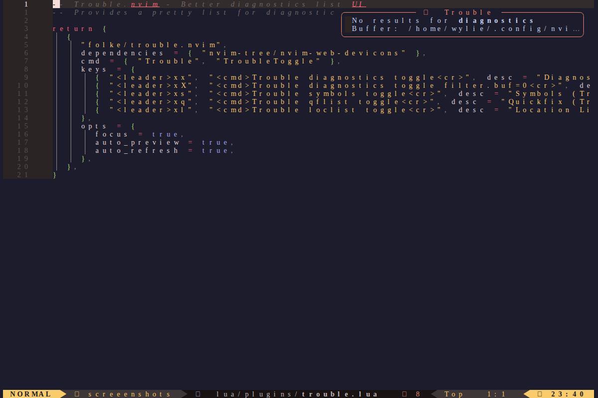
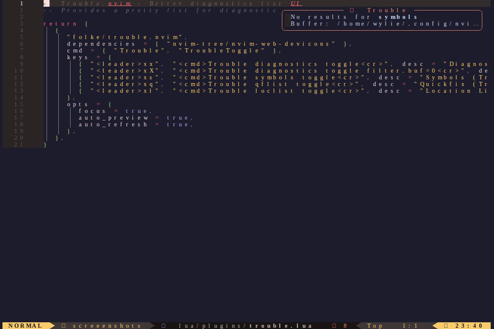

# Trouble.nvim - Diagnostics List

Pretty list for diagnostics, references, quickfix, and more.

## Quick Reference

| Feature | Tool |
|---------|------|
| Plugin | trouble.nvim |
| Author | folke |




## Keybindings

| Key | Mode | Action |
|-----|------|--------|
| `<leader>xx` | n | Toggle all diagnostics |
| `<leader>xX` | n | Buffer diagnostics only |
| `<leader>xs` | n | Document symbols |
| `<leader>xq` | n | Quickfix list (Trouble) |
| `<leader>xl` | n | Location list (Trouble) |

## Usage

### View All Diagnostics

```
1. Press <leader>xx
2. Trouble window opens with all project diagnostics
3. Navigate with j/k
4. Press <CR> to jump to location
5. Press q to close
```

### Buffer Diagnostics Only

```
1. Press <leader>xX
2. Shows only diagnostics for current buffer
3. Useful for focusing on current file
```

### Document Symbols

```
1. Press <leader>xs
2. Shows all symbols in current file
3. Functions, classes, variables, etc.
4. Navigate and jump to symbol
```

### Quickfix in Trouble

```
1. Run a grep or search that populates quickfix
2. Press <leader>xq
3. View quickfix results in Trouble UI
4. Better navigation and preview
```

## Inside Trouble Window

| Key | Action |
|-----|--------|
| `j` / `k` | Navigate items |
| `<CR>` | Jump to item |
| `o` | Jump and close |
| `p` | Preview |
| `P` | Toggle auto preview |
| `q` | Close |
| `r` | Refresh |
| `?` | Help |

## Features

### Auto Preview
- Hovering over an item shows preview
- Toggle with `P`

### Filtering
- Shows diagnostic severity icons
- Groups by file

### Integration
- Works with LSP diagnostics
- Works with quickfix/location lists
- Works with telescope results

## Configuration

Current settings in `lua/plugins/trouble.lua`:

```lua
opts = {
  focus = true,        -- Focus trouble window on open
  auto_preview = true, -- Auto preview on cursor move
  auto_refresh = true, -- Auto refresh diagnostics
}
```

## Tips

### Quick Workflow

```
1. See error underline in code
2. <leader>xx to see all errors
3. Navigate to error
4. <CR> to jump
5. Fix the issue
6. Trouble auto-refreshes
```

### With Telescope

After a Telescope search, send results to quickfix:
```
1. <C-q> in Telescope to send to quickfix
2. <leader>xq to view in Trouble
```

### Keyboard-Only Navigation

```
<leader>xx  -> Open diagnostics
j/k         -> Navigate
<CR>        -> Jump to error
Fix error   -> Auto-refreshes
q           -> Close when done
```
